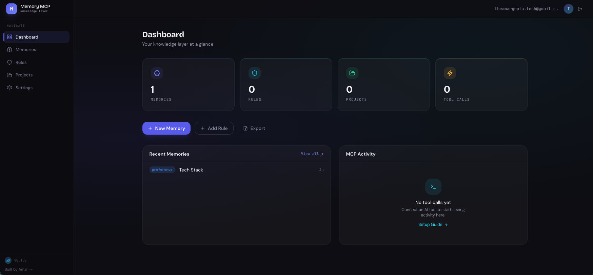
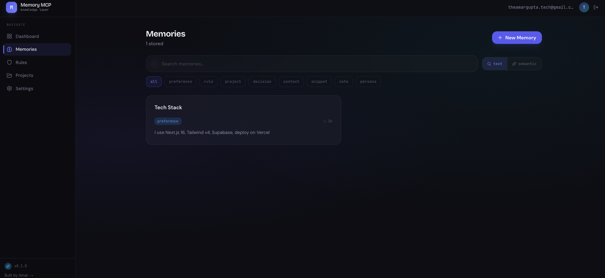
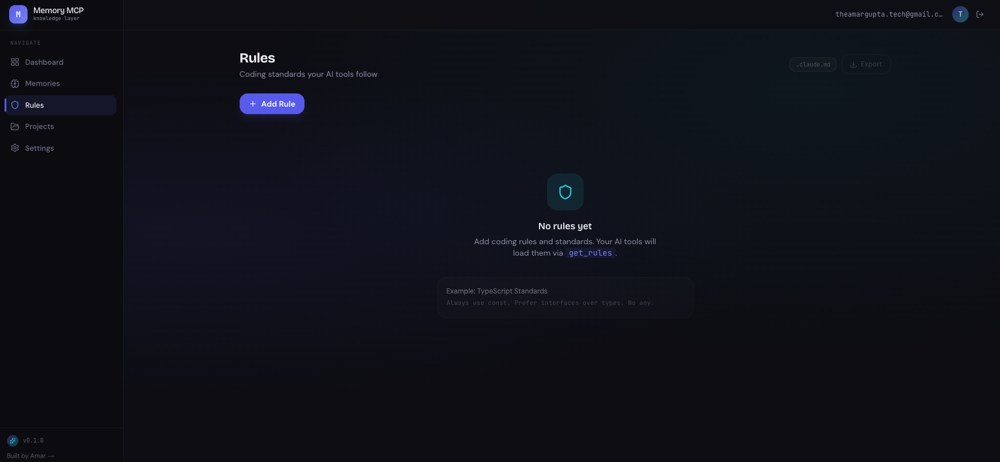

# Memory MCP

**Your AI tools forget everything. Fix that.**

Store your knowledge once — coding rules, tech stack, project context, decisions — and every AI tool reads it through a single MCP endpoint. No more repeating yourself across sessions, tools, or projects.

```
# Before: every session, every tool
"I use Next.js 16, Tailwind v4, Supabase, deploy on Vercel..."
"Always use const over let, never use any in TypeScript..."
"This project uses PostgreSQL because of relational needs..."

# After: connect once, remember forever
claude mcp add --transport http memory-mcp https://your-domain.com/api/mcp
```


---

## Screenshots


*Dashboard with stats, recent activity, and category breakdown*


*Browse, search, filter, and manage memories with semantic search*


*Visual rules editor with .claude.md export*


*Claude Code reading your rules and project context via MCP*

---

## How It Works

```
┌─────────────────────────────────┐
│       Web Dashboard             │
│  memories · rules · projects    │
└──────────────┬──────────────────┘
               │
          Supabase DB
       (PostgreSQL + pgvector)
               │
    ┌──────────┴──────────┐
    │                     │
 REST API          MCP Endpoint
 (Dashboard)     + OAuth 2.0
                      │
       ┌──────┬───────┼───────┐
       │      │       │       │
    Claude  Claude  Cursor  Codex
     Chat    Code    IDE     CLI
```

One endpoint. One OAuth flow. All clients.

---

## Features

### Stop repeating yourself

Every AI tool starts with zero context. Memory MCP fixes that with 8 tools that read and write your personal knowledge base.

`save_memory` stores anything — preferences, rules, decisions, snippets. `get_rules` pulls your coding standards instantly. `get_context` loads an entire project's context in one call.

### Find anything instantly

Semantic search powered by pgvector and a Supabase Edge Function (`gte-small`, 384-dim). Ask "how do we handle API errors?" and get ranked results by meaning, not just keywords. Embeddings are generated automatically on every save.

### Works everywhere

One Streamable HTTP endpoint that any MCP-compatible tool can connect to. Claude Chat, Claude Code, Cursor, Codex — same endpoint, same auth flow, same memories.

### You own your data

Self-hosted on your Supabase instance. Your memories never leave your database. Export everything as JSON anytime. Open source, MIT licensed.

### Production-grade auth

Full OAuth 2.0 with PKCE (S256 mandatory), opaque tokens with SHA-256 hashes stored in DB, token rotation on refresh, instant revocation. No API keys to manage — tools authenticate through a browser-based consent flow.

---

## Quick Start

### Prerequisites

- Node.js 18+
- A [Supabase](https://supabase.com) project (free tier works)
- 5 minutes

### 1. Clone and install

```bash
git clone https://github.com/theamargupta/memory-mcp.git
cd memory-mcp
npm install
```

### 2. Configure environment

```bash
cp .env.local.example .env.local
```

Edit `.env.local`:

```env
NEXT_PUBLIC_SUPABASE_URL=https://your-project.supabase.co
NEXT_PUBLIC_SUPABASE_ANON_KEY=your-anon-key
SUPABASE_SERVICE_ROLE_KEY=your-service-role-key
NEXT_PUBLIC_APP_URL=http://localhost:3000
```

Get these from your Supabase project: **Settings → API**.

### 3. Run database migrations

Run these in order in the **Supabase SQL Editor** (Dashboard → SQL Editor → New Query):

**Migration 1 — Memories table:**

```sql
-- From: supabase/migrations/001_memories.sql

CREATE TABLE memories (
  id            UUID PRIMARY KEY DEFAULT gen_random_uuid(),
  user_id       UUID NOT NULL REFERENCES auth.users(id) ON DELETE CASCADE,
  title         TEXT NOT NULL,
  content       TEXT NOT NULL,
  category      TEXT NOT NULL DEFAULT 'note',
  tags          TEXT[] DEFAULT '{}',
  project       TEXT,
  source        TEXT DEFAULT 'manual',
  metadata      JSONB DEFAULT '{}',
  is_active     BOOLEAN DEFAULT true,
  created_at    TIMESTAMPTZ DEFAULT now(),
  updated_at    TIMESTAMPTZ DEFAULT now(),
  expires_at    TIMESTAMPTZ
);

ALTER TABLE memories ENABLE ROW LEVEL SECURITY;
CREATE POLICY "users_own_memories" ON memories FOR ALL USING (auth.uid() = user_id);

CREATE INDEX idx_memories_user ON memories(user_id);
CREATE INDEX idx_memories_category ON memories(user_id, category);
CREATE INDEX idx_memories_project ON memories(user_id, project);
CREATE INDEX idx_memories_tags ON memories USING GIN(tags);
CREATE INDEX idx_memories_active ON memories(user_id, is_active);

CREATE OR REPLACE FUNCTION update_updated_at_column()
RETURNS TRIGGER AS $$
BEGIN
  NEW.updated_at = now();
  RETURN NEW;
END;
$$ LANGUAGE plpgsql;

CREATE TRIGGER memories_updated_at
  BEFORE UPDATE ON memories
  FOR EACH ROW EXECUTE FUNCTION update_updated_at_column();
```

**Migration 2 — OAuth tables:**

```sql
-- From: supabase/migrations/002_mcp_oauth.sql

CREATE TABLE mcp_oauth_clients (
  id                          UUID PRIMARY KEY DEFAULT gen_random_uuid(),
  client_id                   TEXT UNIQUE NOT NULL,
  client_secret_hash          TEXT,
  client_name                 TEXT,
  redirect_uris               JSONB NOT NULL,
  grant_types                 TEXT[] DEFAULT '{authorization_code,refresh_token}',
  response_types              TEXT[] DEFAULT '{code}',
  scope                       TEXT DEFAULT 'mcp:tools',
  token_endpoint_auth_method  TEXT DEFAULT 'none',
  metadata                    JSONB DEFAULT '{}',
  created_at                  TIMESTAMPTZ DEFAULT now()
);

CREATE TABLE mcp_oauth_authorization_codes (
  id                    UUID PRIMARY KEY DEFAULT gen_random_uuid(),
  code_hash             TEXT UNIQUE NOT NULL,
  client_id             TEXT NOT NULL REFERENCES mcp_oauth_clients(client_id),
  user_id               UUID NOT NULL REFERENCES auth.users(id),
  redirect_uri          TEXT NOT NULL,
  code_challenge        TEXT NOT NULL,
  code_challenge_method TEXT NOT NULL DEFAULT 'S256',
  scopes                TEXT[],
  resource              TEXT,
  expires_at            TIMESTAMPTZ NOT NULL,
  used_at               TIMESTAMPTZ,
  created_at            TIMESTAMPTZ DEFAULT now()
);

CREATE TABLE mcp_oauth_tokens (
  id                  UUID PRIMARY KEY DEFAULT gen_random_uuid(),
  access_token_hash   TEXT UNIQUE NOT NULL,
  refresh_token_hash  TEXT UNIQUE NOT NULL,
  client_id           TEXT NOT NULL REFERENCES mcp_oauth_clients(client_id),
  user_id             UUID NOT NULL REFERENCES auth.users(id),
  scopes              TEXT[],
  resource            TEXT,
  expires_at          TIMESTAMPTZ NOT NULL,
  refresh_expires_at  TIMESTAMPTZ NOT NULL,
  revoked_at          TIMESTAMPTZ,
  last_used_at        TIMESTAMPTZ,
  created_at          TIMESTAMPTZ DEFAULT now()
);

ALTER TABLE mcp_oauth_clients ENABLE ROW LEVEL SECURITY;
ALTER TABLE mcp_oauth_authorization_codes ENABLE ROW LEVEL SECURITY;
ALTER TABLE mcp_oauth_tokens ENABLE ROW LEVEL SECURITY;
CREATE POLICY "deny_all" ON mcp_oauth_clients USING (false);
CREATE POLICY "deny_all" ON mcp_oauth_authorization_codes USING (false);
CREATE POLICY "deny_all" ON mcp_oauth_tokens USING (false);

CREATE INDEX idx_oauth_tokens_access ON mcp_oauth_tokens(access_token_hash);
CREATE INDEX idx_oauth_tokens_refresh ON mcp_oauth_tokens(refresh_token_hash);
CREATE INDEX idx_oauth_tokens_user ON mcp_oauth_tokens(user_id);
CREATE INDEX idx_oauth_codes_hash ON mcp_oauth_authorization_codes(code_hash);
```

**Migration 3 — Access log:**

```sql
-- From: supabase/migrations/003_access_log.sql

CREATE TABLE memory_access_log (
  id          UUID PRIMARY KEY DEFAULT gen_random_uuid(),
  user_id     UUID NOT NULL REFERENCES auth.users(id) ON DELETE CASCADE,
  memory_id   UUID REFERENCES memories(id) ON DELETE SET NULL,
  action      TEXT NOT NULL,
  source      TEXT NOT NULL,
  query       TEXT,
  created_at  TIMESTAMPTZ DEFAULT now()
);

ALTER TABLE memory_access_log ENABLE ROW LEVEL SECURITY;
CREATE POLICY "users_own_logs" ON memory_access_log FOR ALL USING (auth.uid() = user_id);

CREATE INDEX idx_access_log_user ON memory_access_log(user_id);
CREATE INDEX idx_access_log_created ON memory_access_log(user_id, created_at DESC);
```

**Migration 4 — Semantic search** (optional, enables vector search):

First enable the **vector** extension: Supabase Dashboard → Database → Extensions → search "vector" → Enable.

```sql
-- From: supabase/migrations/004_pgvector_embeddings.sql

CREATE EXTENSION IF NOT EXISTS vector;

ALTER TABLE memories ADD COLUMN IF NOT EXISTS embedding vector(384);

CREATE INDEX IF NOT EXISTS idx_memories_embedding ON memories
  USING hnsw (embedding vector_cosine_ops);
```

```sql
-- From: supabase/migrations/006_fix_search_function.sql
-- (Run this instead of 005 — it uses Edge Function embeddings, not DB-side ai.embed)

CREATE OR REPLACE FUNCTION search_memories(
  query_embedding vector(384),
  match_count INT DEFAULT 5,
  p_user_id UUID DEFAULT NULL,
  p_category TEXT DEFAULT NULL,
  p_project TEXT DEFAULT NULL
)
RETURNS TABLE (
  id UUID, title TEXT, content TEXT, category TEXT,
  tags TEXT[], project TEXT, similarity FLOAT
)
LANGUAGE plpgsql AS $$
BEGIN
  RETURN QUERY
  SELECT m.id, m.title, m.content, m.category, m.tags, m.project,
    1 - (m.embedding <=> query_embedding) AS similarity
  FROM memories m
  WHERE m.user_id = p_user_id AND m.is_active = true AND m.embedding IS NOT NULL
    AND (p_category IS NULL OR m.category = p_category)
    AND (p_project IS NULL OR m.project = p_project)
  ORDER BY m.embedding <=> query_embedding
  LIMIT match_count;
END;
$$;
```

**Deploy the Edge Function** for embedding generation:

```bash
supabase functions deploy embed
```

The Edge Function at `supabase/functions/embed/index.ts` uses `gte-small` (384-dim) via the Supabase AI runtime — no external API key needed. Embeddings are generated in app code before writing to the database.

### 4. Start the dev server

```bash
npm run dev
```

Open [http://localhost:3000](http://localhost:3000). Create an account, then connect your AI tools.

---

## Connect Your AI Tools

### Claude Code

```bash
claude mcp add --transport http memory-mcp http://localhost:3000/api/mcp
```

A browser window opens for OAuth consent. Sign in, approve, done. Your tools are now connected.

### Claude Chat

1. Go to **Settings → Connectors → Add Custom Connector**
2. Enter URL: `https://your-domain.com/api/mcp`
3. Authenticate in the browser popup
4. Memory MCP tools appear in Claude's tool list

### Cursor

Add to `.cursor/mcp.json`:

```json
{
  "mcpServers": {
    "memory-mcp": {
      "type": "http",
      "url": "https://your-domain.com/api/mcp"
    }
  }
}
```

### Codex

Add to your Codex config:

```toml
[mcp_servers.memory-mcp]
type = "http"
url = "https://your-domain.com/api/mcp"
```

Replace `your-domain.com` with your deployed URL or `localhost:3000` for local dev.

---

## MCP Tools Reference

Memory MCP exposes 8 tools through the MCP protocol:

| Tool | Description | Key Parameters |
|------|-------------|----------------|
| `save_memory` | Store a new memory | `title`, `content`, `category`, `tags[]`, `project` |
| `search_memory` | Semantic search by meaning | `query`, `limit`, `category`, `project` |
| `list_memories` | Browse with filters | `category`, `tag`, `project`, `limit` |
| `get_memory` | Retrieve by ID | `memory_id` |
| `update_memory` | Patch specific fields | `memory_id`, `title`, `content`, `category`, `tags`, `project` |
| `delete_memory` | Soft delete (reversible) | `memory_id` |
| `get_rules` | All rule-category memories | `project` (optional) |
| `get_context` | All memories for a project | `project` |

### Example: Claude Code using your rules

```
You: "Refactor this component"

Claude Code internally:
  → get_rules() → returns your coding standards
  → get_context(project: "my-app") → returns project-specific context

Claude Code: "Based on your rules, I'll use functional components,
server components where possible, Zod for validation, and path aliases..."
```

### Example: Saving a memory from any tool

```
You: "Remember that we chose PostgreSQL over MongoDB for this project
     because of relational data needs and Supabase hosting"

Tool call: save_memory(
  title: "Database Choice",
  content: "Chose PostgreSQL over MongoDB for relational data needs...",
  category: "decision",
  project: "my-app"
)

Response: { id: "550e8400-...", message: "Memory saved successfully" }
```

### Example: Semantic search

```
Tool call: search_memory(query: "how do we handle errors in APIs")

Response: {
  results: [
    {
      title: "API Error Handling Pattern",
      content: "Always return { success, data, error }. Never throw from routes.",
      category: "rule",
      similarity: 0.92
    }
  ]
}
```

### Memory categories

`preference` · `rule` · `project` · `decision` · `context` · `snippet` · `note` · `persona`

---

## Dashboard

**Memories** — Browse, create, edit, delete memories. Filter by category, tag, project. Toggle between text search and semantic search (with similarity % badges).

**Rules** — Dedicated editor for rule-category memories. Add rules with optional project scope. Export all rules as a `.claude.md` file grouped by project.

**Projects** — Auto-grouped view of all project-scoped memories. Shows memory count, category breakdown, expandable detail view.

**Settings** — MCP connection manager (view/revoke active sessions), JSON import/export, embedding backfill, copy-paste setup commands for all AI tools.

**Dashboard** — Overview with stat cards (total memories, rules, projects, categories), MCP tool call analytics, recent activity feed, category distribution chart.

---

## Tech Stack

| Layer | Technology | Why |
|-------|-----------|-----|
| Framework | Next.js 16 (App Router) | Server components, API routes, Vercel deployment |
| UI | Tailwind v4 + ShadCN v4 | Rapid, consistent component library |
| Auth (Web) | Supabase Auth | Built-in email/password, session management |
| Auth (MCP) | Custom OAuth 2.0 + PKCE | MCP spec compliance, no API keys for clients |
| Database | Supabase PostgreSQL | Managed Postgres, RLS, realtime |
| Vector Search | pgvector + Edge Function | Native Postgres vectors, `gte-small` embeddings via Supabase Edge Function |
| MCP Server | `@modelcontextprotocol/sdk` | Official SDK, Streamable HTTP transport |
| Validation | Zod | Runtime schema validation for tool inputs |
| Deployment | Vercel | Edge-optimized, zero-config for Next.js |

---

## Self-Hosting / Deploy

### Vercel (recommended)

1. Push to GitHub (or fork this repo)
2. Import in [Vercel](https://vercel.com/new)
3. Add environment variables:
   - `NEXT_PUBLIC_SUPABASE_URL`
   - `NEXT_PUBLIC_SUPABASE_ANON_KEY`
   - `SUPABASE_SERVICE_ROLE_KEY`
   - `NEXT_PUBLIC_APP_URL` — your Vercel domain (e.g. `https://memory-mcp.vercel.app`)
4. Deploy

### Supabase setup

1. Create a project at [supabase.com](https://supabase.com)
2. Run the 4 migration SQL blocks from [Quick Start](#3-run-database-migrations)
3. Enable the **vector** extension for semantic search (Database → Extensions)
4. Copy your project URL, anon key, and service role key to env vars

### After deploy

Update the MCP connection URL in your AI tools to your production domain:

```bash
claude mcp add --transport http memory-mcp https://your-domain.com/api/mcp
```

---

## Architecture

### OAuth flow

```
Client → GET /.well-known/oauth-authorization-server → metadata
       → POST /oauth/register → client_id (DCR)
       → GET /oauth/authorize → consent page (Supabase Auth session)
       → POST /oauth/authorize → auth code (PKCE S256)
       → POST /oauth/token → access_token + refresh_token
       → POST /api/mcp (Bearer) → tool dispatch
       → POST /oauth/token (refresh) → rotated token pair
       → POST /oauth/revoke → soft revoke
```

### MCP endpoint

Stateless per-request pattern (required for Vercel serverless):

```typescript
// New McpServer instance every request
const server = createMcpServer()
const transport = new WebStandardStreamableHTTPServerTransport()
await server.connect(transport)
return transport.handleRequest(request, { authInfo })
```

### Security decisions

- **Opaque tokens, not JWTs** — SHA-256 hashes in DB, instant revocation, `last_used_at` tracking
- **PKCE S256 mandatory** — no opt-out, even for public clients
- **Token rotation** — old pair revoked on every refresh, stolen tokens detectable
- **Auth codes single-use** — `used_at` field prevents replay
- **Redirect URI allowlist** — claude.ai, chatgpt.com, openai.com, localhost
- **`server-only` import** — prevents OAuth code from bundling into client

### Database

4 tables: `memories` (user-scoped, RLS), `mcp_oauth_clients` / `mcp_oauth_authorization_codes` / `mcp_oauth_tokens` (service-role only, deny-all RLS), `memory_access_log` (user-scoped, RLS).

Full schemas in [`supabase/migrations/`](./supabase/migrations/).

---

## Contributing

PRs welcome. To set up the dev environment:

```bash
git clone https://github.com/theamargupta/memory-mcp.git
cd memory-mcp
npm install
cp .env.local.example .env.local
# Fill in your Supabase credentials
npm run dev
```

The codebase is straightforward — `lib/mcp/` has the MCP server and OAuth logic, `app/api/` has the REST routes, `app/(dashboard)/` has the UI pages, `supabase/migrations/` has the DB schema.

---

## License

MIT
